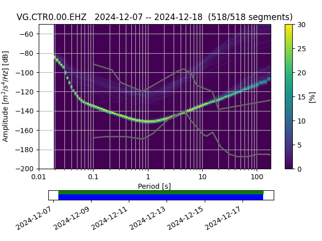
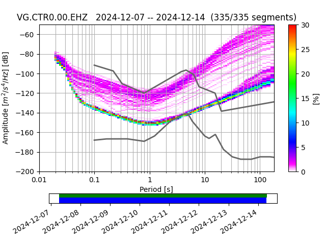

# Probability Power Spectral Density Documentation

## 📘 Introduction
This repository contains two main parts of Python code for processing and analyzing seismic data using the **ObsPy**:

1. **Merging mSEED data** from multiple sources (stations or different times).
2. **Probability Power Spectral Density (PPSD) analysis** to visualize the noise spectrum.

Each section is explained step-by-step to ensure easy learning.

---

## 1. Merging mSEED Files
###  Objective:
To merge two MiniSEED (`.mseed`) files from the same station or time to create continuous data.
### Code Explanation:
Import the `read()` function from ObsPy to read seismic data files, then define the path to the first file.
```python
from obspy import read
file1 = "CTR0_EHZ_VG_00.011000.mseed"
file1 = "CTR0_EHZ_VG_00.012000.mseed"
```
mSEED files are typically named following a standard format reflecting metadata information. To merge data from multiple files or folders, the paths for the subsequent files are required.

```python
st1 = read(file1)  
st2 = read(file2)
st = st1 + st2
```
Read the paths of the first and second files, then merge `st1` and `st2` into a single stream.
```python
st.merge(method=1)  
output_file = "merged_file.mseed"  
st.write(output_file, format="MSEED")  
print(f"File mSEED berhasil digabungkan menjadi: {output_file}") 
```
The merge process uses `method=1`, which will interpolate if there is overlap or a gap. Save the merged stream into a new file named `merged_file.mseed.` A confirmation will be displayed in the console that the file has been created.
```python
1 Trace(s) In STream:
VG.CTR0.00.EHZ | 2024-12-7 6:49:59.000000 Z - 2024-12-14 7:00:01.000000 Z | 100.0 Hz, 8700201 samples
```
##  2. Probability Power Spectral Density (PPSD)
###  Objective:
Use the PPSD method to observe the noise spectrum characteristics of seismic data.
### Code Explanation:
Import functions to read waveforms and XML metadata.
```python
from obspy import read, read_inventory
st = read("CTR0.EHZ.VG.00..mseed")
tr = st.select(id="VG.CTRO.00.EHZ")[0]
inv = read_inventory("CTR0.EHZ.VG.00.xml")
```
To obtain information and specifications about the seismic data, you can use `print(st.__str__(extended=True))`. Then, read the instrument response metadata for the channel and create a `PPSD` object with the metadata.
```python
from obspy.signal import PPSD
ppsd = PPSD(tr.stats, metadata=inv)
```
Add the data stream to the PPSD for analysis.
```python
ppsd.add(st)
>>True
```
Display both standard and cumulative PPSD results.
```python
ppsd.plot()
ppsd.plot(cumulative=True)
```


---
To visualize the noise distribution, you can use the standard PQLX colormap.
```python
from obspy.imaging.cm import pqlx
ppsd.plot(cmap=pqlx)
```



## Conclusion
This documentation aims to provide a structured understanding of the seismic data merging process and spectral analysis using the PPSD method with the help of the ObsPy library. The detailed steps are designed to assist users, especially beginners, in understanding the logic behind processing mSEED data and the importance of statistical representation in evaluating seismic signal quality. With this approach, it is hoped that the data analysis process can be more efficient and accurate, serving as a strong foundation for further analyses such as seismic monitoring or earthquake source modeling.

I would like to express my gratitude to the institutions that provided access to seismic data and to everyone who supported the development of this documentation and data processing. Without the contribution of data and technical support from various parties, this learning and research process would not have been as optimal.

